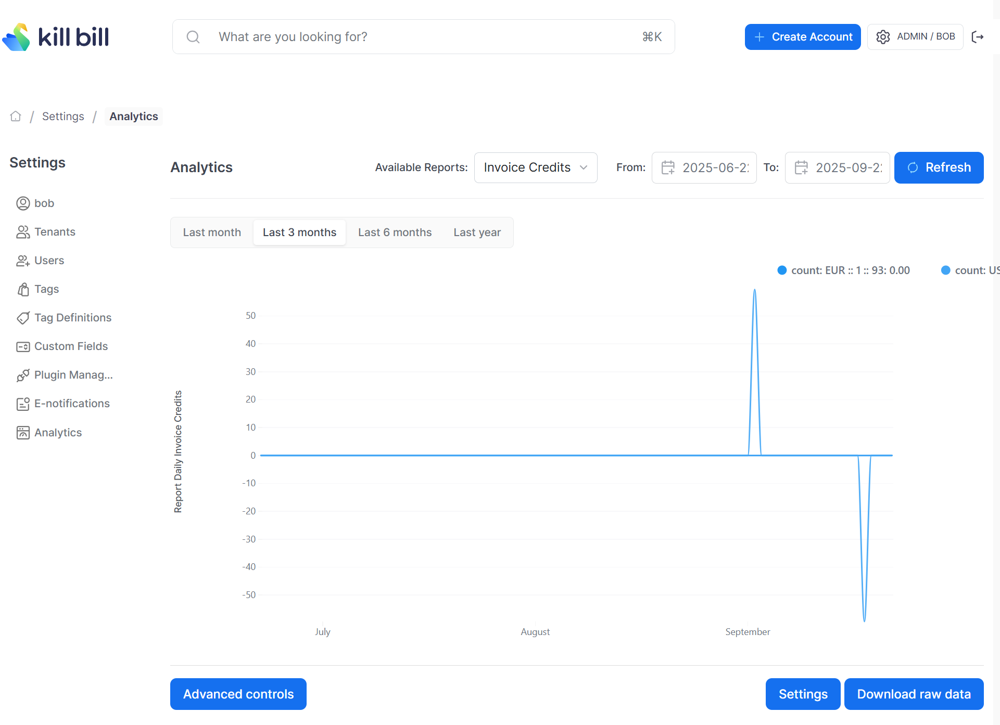

# Daily Invoice Credits Report

Total of invoice credits per tenant, per currency and per day.

So if there is an unpaid invoice for `$20` on `2025-09-22`, and an account credit is added for `$100` on the same day, there is a invoice credit of `$80` which will be shown on this report. If however, a new charge of `$200` is created later on on the same day, the `$80` credit is consumed so the total credit displayed by the report for `2025-09-22` is now `$0`. 

The snapshot view is: [v_report_invoice_item_credits_daily](v_report_invoice_item_credits_daily.ddl)

## Report Creation

```
curl -v \
     -X POST \
     -u admin:password \
     -H "X-Killbill-ApiKey:bob" \
     -H "X-Killbill-ApiSecret:lazar" \
     -H 'Content-Type: application/json' \
     -d '{"reportName": "report_daily_invoice_credits",
          "reportType": "TIMELINE",
          "reportPrettyName": "Invoice Credits Daily",
          "sourceTableName": "report_invoice_credits_daily",
          "refreshProcedureName": "refresh_report_invoice_credits_daily",
          "refreshFrequency": "DAILY"}' \
     "http://127.0.0.1:8080/plugins/killbill-analytics/reports"
```

## Sample Data

| Tenant Record Id | Currency | Day        | Count    |
|------------------|----------|------------|----------|
| 1                | USD      | 2025-05-05 | 0.0000   |
| 1                | USD      | 2025-09-19 | 80.0000  |
| 22               | USD      | 2025-09-19 | 125.0000 |
| 22               | EUR      | 2025-09-22 | 45.0000  |
| 22               | USD      | 2025-09-18 | -10.0000 |

This means that on `2025-09-19`, there was a total invoice credit of `$80` for the tenant_record_id=1.


## Report UI:

